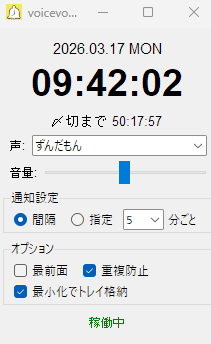

# voicevox_chime


ずんだもんを始めとする VOICEVOX キャラクターたちが、正確な時刻をお知らせするデスクトップアプリです。

## 特徴
- **マルチキャラクター**: 7人のキャラクターからお好みの声を選択可能。
- **柔軟なスケジュール**: 「1分〜60分ごとの一定間隔」または「毎時指定した分」に時報を鳴らせます。
- **〆切カウントダウン**: 任意の〆切までの残り時間を「00:00:00」形式で表示。クリックで日時を自由に変更可能。
- **表示切替**: 日付ラベルをクリックすることで、表示形式（ドット形式 / 日本語・曜日形式）を切り替えられます。
- **本格的な時報音**: 5秒前からのカウントダウン（ピッ、ピッ、ピッ、ピッ、ポーン）と、時・分の連続読み上げ。
- **実用的なオプション**: 最前面表示、ウィンドウ位置の記憶、音量調整、システムトレイ常駐など。

## クレジット（音声ライブラリ）
本アプリの音声には、以下の VOICEVOX キャラクターを使用しています。

- VOICEVOX:ずんだもん
- VOICEVOX:四国めたん
- VOICEVOX:春日部つむぎ
- VOICEVOX:もち子(cv 明日葉よもぎ)
- VOICEVOX:WhiteCUL
- VOICEVOX:No.7
- VOICEVOX:ナースロボ＿タイプＴ

## 使い方
### EXEから起動する場合
[release](https://github.com/chchannel/voicevox_chime/releases)から最新版のvoicevox_chime.exeをダウンロードし実行します。

### Pythonソースから起動する場合
以下のコマンドを実行します（要: tkinter, pygame, Pillow, pystray）。
```powershell
python chime_app.py
```

## ライセンス
- ソフトウェア本体：非商用利用に限り、自由にご利用・再配布いただけます。
- 音声データ：各 VOICEVOX キャラクターの利用規約に従ってください。

---
Developed by Antigravity
